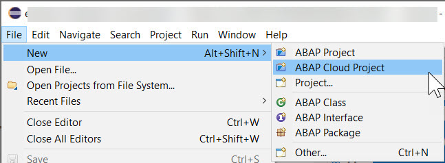
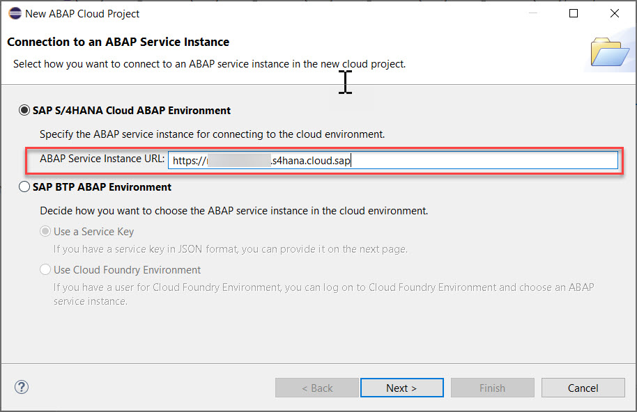
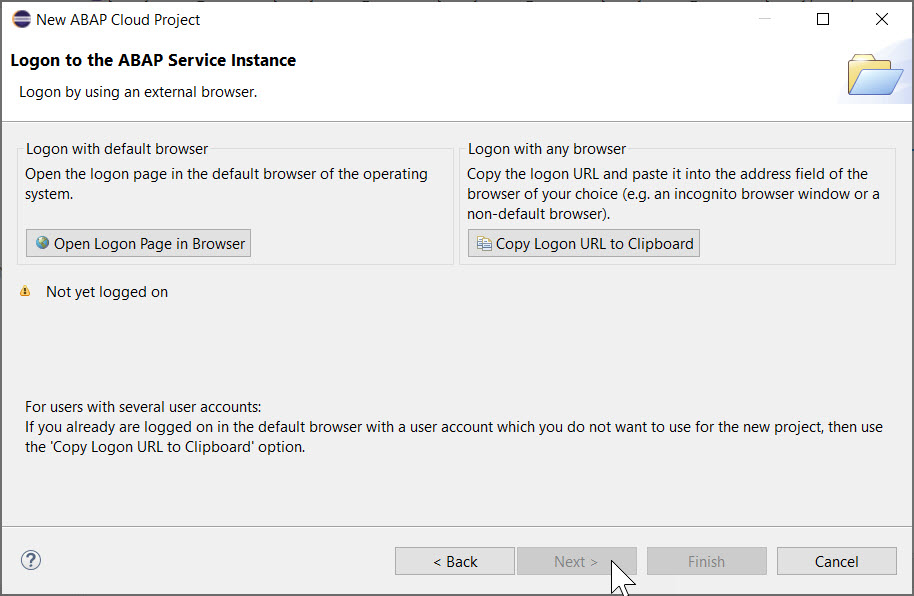
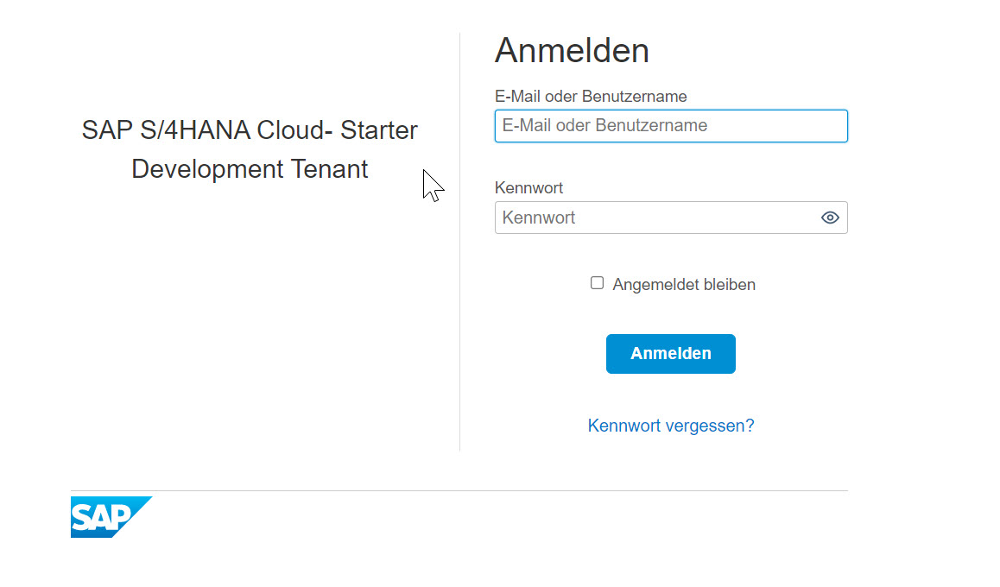
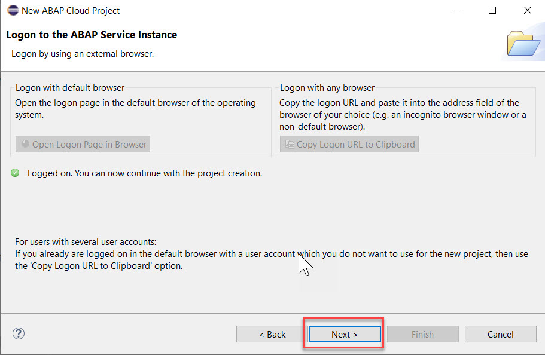
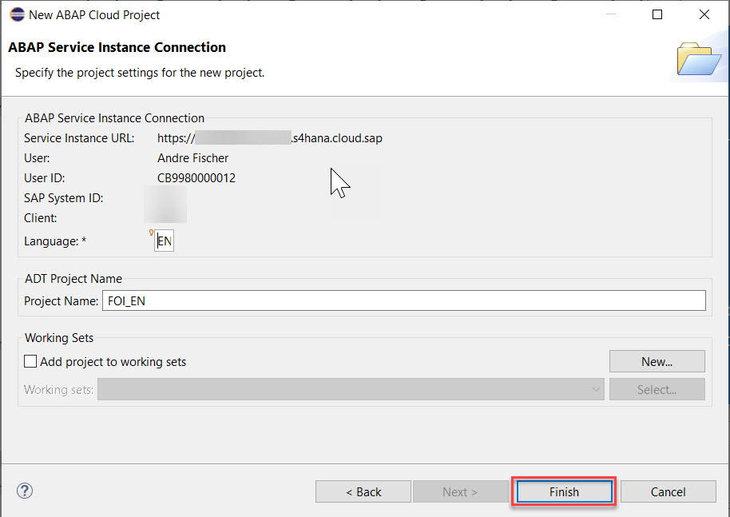

# Step 1: Log on to SAP S/4HANA Cloud ABAP Environment

**Use ABAP Development Tools (ADT) to access SAP S/4HANA Cloud ABAP Environment**

1. Open ADT and select File > New > Other.
  
   

2. Select **SAP S/4HANA Cloud ABAP Environment** and enter the URL of your SAP S/4HANA Cloud ABAP Environment system in the text box **ABAP service instance URL** and choose **Next**.
   
   
   
3.	To log on, choose **Open Logon Page in Browser**.

    

4.  In the logon screen enter the email adress and the password

    

5.  After having authenticated successfully, you can now choose **Next**.

     

6.  In the **ABAP Service Instance Connection** screen you can leave the default settings and press **Finish**.

    

Your project is available in the Project Explorer.

# Step 2: Create a package

First, create a package for your development objects.

1.	Right-click on your project, then choose **New > ABAP Package** from the context menu.

    
    
2.	Enter the following:
    - Name: **Z_MM_PUR_S4_BADI_###**
    - Description: **BADIs for MM Purchasing**
    - Super Package: **ZLOCAL**

    Choose **Add to favorite packages**, then choose **Next**
    
    
  
4.	Choose **Create a new request**, enter a meaningful description, e.g. *Test BADIs MM-PURCHASING* then choose **Finish**.

    

5.  Your newly created package is now visible in the project explorer
  
     

