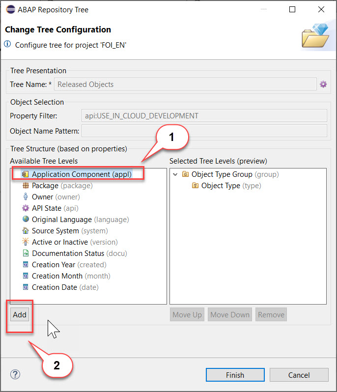
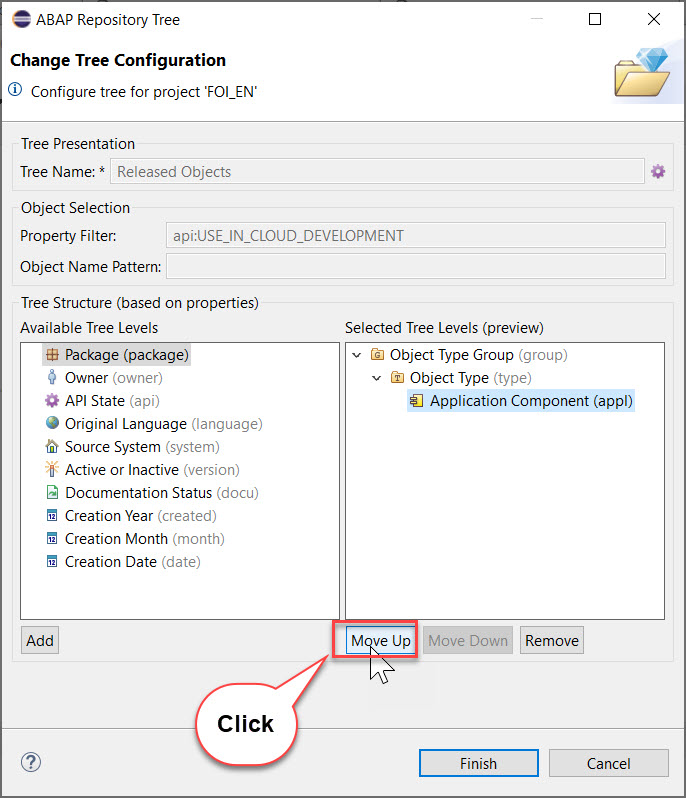
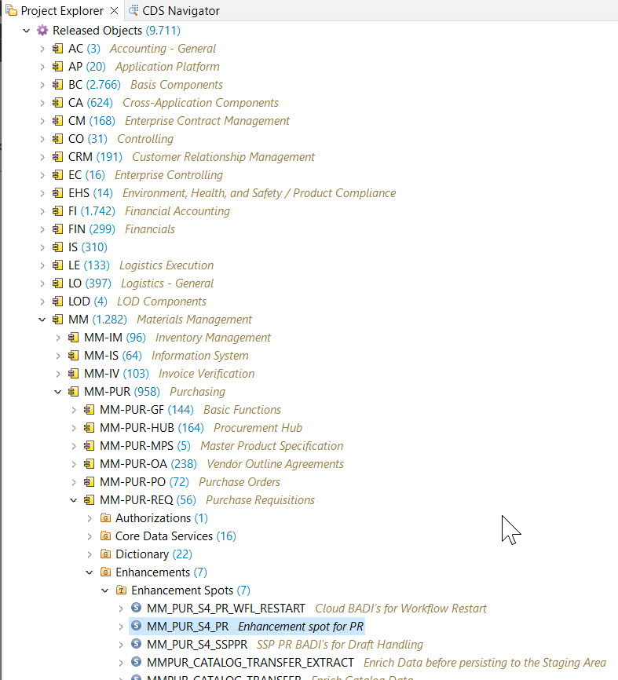

# Step : Choose enhancement spot

As you can see there is large number of released APIs available in an SAP S/4HANA Cloud system. For an application developer the most convenient type of access is to use the application components for navigation. We will thus show how the navigation in the project explorer can be adapted so that the tree shows the *Released Objects* sorted by *Application Component*.  
These *Released Objects* are modification-free and upgrade stable. They can be used to extend a existing application or build a new application using the released APIs.

## Display released APIs by application component

1.	In your project, navigate to **Released Objects**. 

  
  
2.	Choose **Configure Tree** from the context menu, then select **Application Component** from the left side ( *Available Tree Levels* ) and click **Add** to move it to the right side ( *Selected Tree Levels* ). 

   

3.	Now click on **Move up** to move the entry ***Application Component** to the top of the *Selected Tree Levels*

   

4.	After having moved it to the top, press **Finish**.
   
   

5.	In the tree, drill down to **MM-PUR-REQ > Enhancements > Enhancement Spots > MM_PUR_S4_PR** and open it by double-clicking.

    


6.  The BAdI enhancement spot appears in a new editor, showing you the available BAdI definitions (1). To help you create your own enhancements, example classes are provided (2).

    

 **Step 4:** Create enhancement implementation
 
Now that you have identified the correct enhancement spot, you need a container within this enhancement spot for your BADI implementations. This is known as an enhancement implementation.

1.	Select your package Z##_MM_PUR_S4_BADI and choose New > Other ABAP Object from the context menu.
  
2.	Filter by BAdI, choose BAdI Enhancement Implementation, then choose Next.

3.	Add the following and choose Next.

o	Name: Z##_BADI_CHECK_PURCH_REQ

o	Description: Checks when creating new purchase requisition

o	Enhancement Spot: MM_PUR_S4_PR

 
4.	Choose the transport request, then choose Finish.	
Your BAdI enhancement implementation appears in a new editor. It implements the enhancement spot MM_PUR_S4_PR.

 
**Step 5:** Add `BAdI` Implementation
1.	Choose **Add BAdI Implementation**.

2.	Add the following, then choose Next:
<br/>**o**	BAdI Definition: MM_PUR_S4_PR_CHECK (Add by clicking on Browse)
<br/>**o**	BAdI Implementation Name: Z##_IMPL_CHECK_PURCH_REQ

  
Ignore the error. You will fix this in the next step.

**Step 6:** Create implementing class
1.	Choose Implementing Class.
  
2.	Add the following, then choose Next.
Replace JP/## in the image with your initials. For ex: HB or HB01/HB02.
<br/>o	Name: Z##_CHECK_PURCH_REQ
<br/>o	Description: Implement checks on creating Purchase Requisition
<br/>o	(Added automatically): Interfaces: IF_MM_PUR_S4_PR_CHECK

  
3.	Choose the transport request, then choose Finish.
The class appears in a new editor with skeleton code.
  
4.	Format, save, and activate the class ( Shift+F1, Ctrl+S, Ctrl+F3 ).
5.	Go back to your BAdI implementation Z##_IMPL_CHECK_PURCH_REQ and activate it too.
The error will disappear.

Step 7: Implement code
1.	Add the following code to the method implementation if_mm_pur_s4_pr_check~check..

 <details>
  <summary>Click to expand!</summary>
  
```
DATA(lv_tech_name) = cl_abap_context_info=>get_user_formatted_name( ).
DATA ls_message TYPE mmpur_s_messages.
	
TRY.
	
    IF lv_tech_name = '###Your Name###Max Mustermann###'.
READ TABLE  purchaserequisitionitem_table  INTO DATA(ls_pur_req_itm) INDEX 1    .

IF ls_pur_req_itm-orderedquantity > 10.
  ls_message-messageid = 'DUMMY'.
  ls_message-messagetype = 'E'.
  ls_message-messagenumber = '001'.
  ls_message-messagevariable1 = ' Quantity limit 10'.           "Place holder
  APPEND ls_message TO messages.
ENDIF.

IF ls_pur_req_itm-deliverydate - ( cl_abap_context_info=>get_system_date( ) ) > 180.
  ls_message-messageid = 'DUMMY'.
  ls_message-messagetype = 'E'.
  ls_message-messagenumber = '001'.
  ls_message-messagevariable1 = 'Delivery date limit 180 days '.           "Place holder
  APPEND ls_message TO messages.
ENDIF.
	
ENDIF.
	
ENDTRY.
```
<details>

2.	Format, save, and activate ( Shift+F1, Ctrl+S, Ctrl+F3 ) your code.
Check that yours is the implementation that will be called:

 

Step 8: Test BAdI

Now test that the checks are performed in the app.
1.	In SAP Fiori launchpad, open the app Manage purchase Requisitions (Professional).

 
 
2.	Display the existing purchase requisitions by choosing Go or choose Create for new purchase requisition.

 
 
3.	In the next screen, choose Create again, then choose Material.

 
 
4.	The Details screen appears. From the Material field, choose Value Help.

6.	Then choose the material RM122, Plant 1010. choose the option with material - RM122, Plant - 1010 and plant name - Plant 1 DE

 
 
	The system fills some fields with default values. Now enter a wrong quantity, e.g. 20, and date, e.g. 09.11.2021.
  
 
 
7.	The system shows you errors and in some cases warnings which arebased on delivery date). To display the errors, select the red box at the bottom left.
 
 You can either correct the warning or ignore it.
 
 
 
8.	Enter correct values, choose Apply, then choose create.

Your new order appears in the Overview List..

 
 
 Now, you can continue with [Exercise 2](Scenario.md)

 
 [Back<-Create your Own BaDl Implementation](Create_Your_Own_BaDl_Implementation.md)
