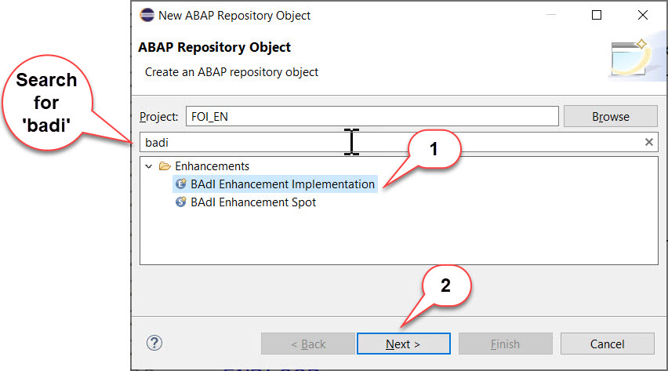

# BAdI implementation 

## Enhancement implementation

Now that you have identified the correct enhancement spot, you need a container within this enhancement spot for your BADI implementations. This is known as an enhancement implementation.
This enhancement implementation incorporates the implementation class for your custom implementation.

1.	Select your package **Z_MM_PUR_S4_BADI_###** and choose **New > Other ABAP Repository Object** from the context menu.

    
  
2.	In the **New ABAP Repository Object** dialogue you can filter / search for the string `BAdI`. From the result choose `BAdI Enhancement Implementation`, then choose **Next**.
    
    
        
4.  In the **New BAdI Enhancement Implementation** dialogue enter the following values:

    -  **Name**: `Z_BADI_CHECK_PURCH_REQ_###`
    -  **Description**: `Checks when creating new purchase requisition`
    -  **Enhancement Spot**: `MM_PUR_S4_PR`

    

5.  Choose the transport request, then choose **Finish**.

6.  Your BAdI enhancement implementation appears in a new editor. It implements the enhancement spot **MM_PUR_S4_PR**.

    

7.  Now do the following

    1. In Click on **Add BAdI implementation**  
    2. **BAdI Definition**: `MM_PUR_S4_PR_CHECK` (Add by clicking on Browse) 
       and fill the field **BAdI Implementation Name**: `Z_IMPL_CHECK_PURCH_REQ_###`
    3. Press **Add**  
     
    
    
8.  Click on **Implementation Class**. (This will fix the error about the missing class.) 

    
    
	Add the following data, then choose **Next**.
    
    - **Name**: `Z_CL_CHECK_PURCH_REQ_###`
    - **Description**: `Implement checks on creating Purchase Requisition`
    
    The entry for interfaces: IF_MM_PUR_S4_PR_CHECK is added automatically.
    
    Press **Next**  
    
    
    
9.	Choose the transport request, then choose **Finish**.

10. The class appears in a new editor with skeleton code.
   
11.	Format, save, and activate the class `ZCL_CHECK_PURCH_REQ_###` ( Press **Shift+F1, Ctrl+S, Ctrl+F3** ).

13.	Go back to your BAdI implementation `Z_IMPL_CHECK_PURCH_REQ_###` and activate it too. (The error will disappear.)

14. Implement the class by adding the following code to the implementation of the method `if_mm_pur_s4_pr_check~check`.

    ```
    IF sy-uname = 'CB#########' or  ( cl_abap_context_info=>get_user_technical_name( ) ) = 'CB########'.
    DATA ls_message TYPE mmpur_s_messages.
    READ TABLE  purchaserequisitionitem_table  INTO DATA(ls_pur_req_itm) INDEX 1    .

      IF ls_pur_req_itm-orderedquantity > 10.
        ls_message-messageid = 'DUMMY'.
        ls_message-messagetype = 'E'.
        ls_message-messagenumber = '001'.
        ls_message-messagevariable1 = ' Quantity limit 10'.           "Place holder
        APPEND ls_message TO messages.
      ENDIF.

      IF ls_pur_req_itm-deliverydate - ( cl_abap_context_info=>get_system_date( ) ) > 180.
        ls_message-messageid = 'DUMMY'.
        ls_message-messagetype = 'E'.
        ls_message-messagenumber = '001'.
        ls_message-messagevariable1 = 'Delivery date limit 180 days '.           "Place holder
        APPEND ls_message TO messages.
      ENDIF.
    ENDIF.
    ```
15.	Format, save, and activate the coding by pressing **Shift+F1, Ctrl+S** and **Ctrl+F3**.

16. In order to make sure that your BAdI implementation is only called for your user replace the placeholders `CB#########` in the coding with your business user id e.g.: **CB9980000012**. You can retrieve your business user id by right clicking on your project, select **Properties** and select **ABAP Development**.  

   
   
   


In the next exercise we will test our implementation.  
