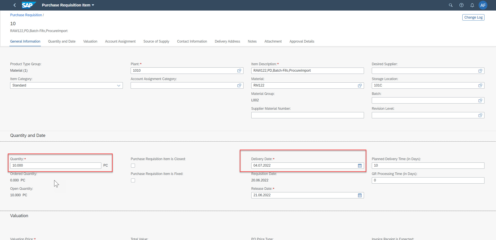

# Test BAdI implementation
You can now check whether the custom code for quantity and delivery date checks is triggering error messages on the UI:
To access the **Manage Purchase Requisitions Professional** App, use the following steps.

1.	Open the Fiori Launchpad of your SAP S/4HANA Cloud system and search for the application **Manage Purchase Requisitions Professional**.

    
    
2. You can press **Go** to get a list of existing purchase order requisitions or you can press **Create** in order to create a new requistion from scratch. '

       
   
3. When creating a new purchase requisition select the tab **Items** and then press again **Create** and then choose **Material**.

   

4. On the **General Information** tab select the field **Material** and use the value help to select a material.   
   
   
   
5. Then choose the **material** `RM122`, **Plant** `1010`. Choose the option with **material - RM122, Plant - 1010 and plant name - Plant 1 DE**

    
    
6. The system fills some fields with default values. Now enter a *wrong quantity*, e.g. 20, and a *wrong delivery date* , e.g. 09.11.2021.    

   

7. The system shows you errors and in some cases warnings which are based on delivery date. To display the errors, select the red box at the bottom left. you can either correct the warning or ignore it.

   

Now, you can continue with the workshop  that introduces the use of RAP facades.
