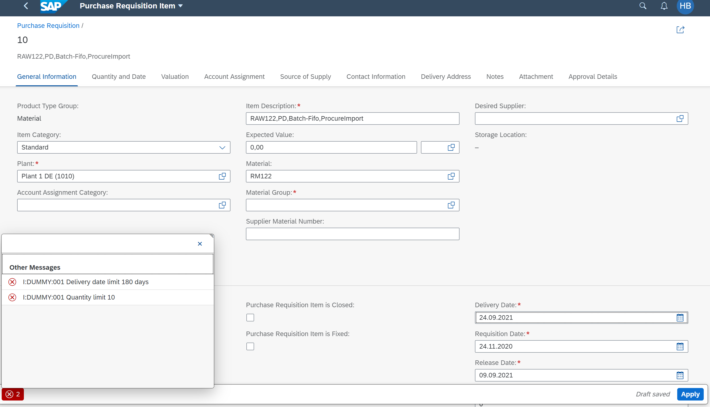

# RAP600: Developer extensibility with SAP S/4HANA Cloud ABAP Environment - BAdIs

<!-- 
## Description
-->

This repository contains the material for the hands-on session **RAP600 - Developer extensibility with SAP S/4HANA Cloud ABAP Environment - BAdIs**.

- [Requirements for attending this workshop](#requirements-for-attending-this-workshop)
- [Overview](#overview)
- [Exercises](#exercises)
- [How to obtain support](#how-to-obtain-support) 
- [Further Information](#further-information)

## Requirements for attending this workshop 
[^Top of page](#)

In order to participate in this hands-on session, you MUST have installed the latest version of Eclipse and the latest version of the ABAP Development Tools (ADT) in Eclipse.
Please check the following two short documents how to do this if you have not already done it:  
- [Install the ABAP Development Tools (ADT)](https://github.com/SAP-samples/abap-platform-rap-workshops/blob/main/requirements_rap_workshops.md#3-install-the-abap-development-tools-adt)  
- [Adapt the Web Browser settings in your ADT installation](https://github.com/SAP-samples/abap-platform-rap-workshops/blob/main/requirements_rap_workshops.md#4-adapt-the-web-browser-settings-in-your-adt-installation)  
 
You also need a user on an SAP S/4HANA Cloud ABAP Environment system.  
> **Note for participants of SAP events:** You will recieve logon information from the SAP team during the event. 

## Overview
[^Top of page](#)

This hands-on workshop will guide you to build developer extensions using **Business Add-In (BAdI)** in an SAP S/4HANA Cloud ABAP Environment system (aka _Embedded Steampunk_). A **BAdI** enables you to implement enhancements to standard SAP applications without modifying the original code.

As a result of this workshop the *Manage Purchase Requisitions App* will show a different behavior. When at the end of this workshop the user creates a purchase requisition the following checks will be active based on the implemented enhancements:  

1.	It will be checked if the quantity of items ordered is 10 or fewer
2. It will be checked if the date is 180 days or less in advance

If one or both checks fail, the application will return an error as shown in the following screen shot:

## Exercises
[^Top of page](#)

| Exercises |  
| ------------- | 
| [Get started](ex0/README.md) | 
| [Exercise 1: Choose enhancement spot](ex1/README.md) | 
| [Exercise 2: BAdI implementation](ex2/README.md) | 
| [Exercise 3: Test BAdI implementation](ex3/README.md) | 

In this workshop, the BAdI is implemented in the SAP Fiori app as follows:
1.	Use an existing enhancement spot **MM_PUR_S4_PR**, with an existing BADI definition **MM_PUR_S4_PR_CHECK**
2.	Create a container ( enhancement implementation ) in the enhancement spot
3.	Create a BADI implementation for the BADI definition.

## How to obtain support
[^Top of page](#)

Support for the content in this repository is available during the actual time of the online session for which this content has been designed. Otherwise, you may request support via the [Issues](../../../../issues) tab.

## Further Information
[^Top of page](#)

You can find further information on the different topics here: 
- [SAP S/4HANA Cloud ABAP Environment](https://www.sap.com/about/events/teched-news-guide/composable-enterprise-solutions.html)
- [New ABAP Platform Extensibility Options for SAP S/4HANA](https://blogs.sap.com/2021/11/19/new-abap-platform-extensibility-options-in-2021/)
- [ABAP Extensibility Topic Page @SAP Community](https://community.sap.com/topics/abap-extensibility)
- [Getting Started with the ABAP RESTful Application Programming Model (RAP)](https://blogs.sap.com/2019/10/25/getting-started-with-the-abap-restful-programming-model/)

## License
Copyright (c) 2022 SAP SE or an SAP affiliate company. All rights reserved. This file is licensed under the Apache Software License, version 2.0 except as noted otherwise in the [LICENSE](LICENSES/Apache-2.0.txt) file.
