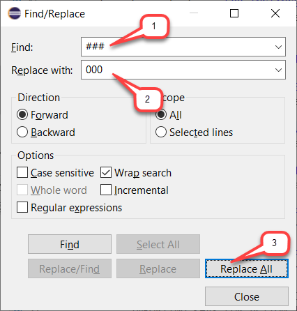
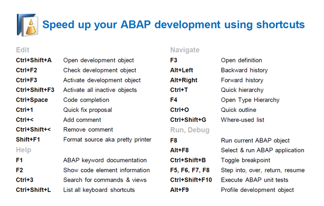

[Home - RAP610](../../#exercises)

# Exercise 0: Getting Started

---
> **PLEASE NOTE**:    
>  
> Participants of SAP events will receive logon information - i.e. system information and user credentials - to an SAP S/4HANA Cloud ABAP Environment system from the SAP team during the respective event.
---

## Introduction

You've already received the credentials to the SAP S/4HANA Cloud ABAP environment system from the SAP Team, 
and created a destination to the ABAP environment in the ABAP Development Tools in Eclipse (ADT) an _ABAP Cloud Project_ as described in the [Requirements](#requirements) section.

Please note that ADT dialogs and views as well as Fiori UIs may change in upcoming releases.

<!--
- [Requirements](#requirements)
- [Login to FOI/080](#login-to-foi080)
- [Group ID](#group-id)
- [Find/Replace](#findreplace)
- [Modern ABAP Syntax](#modern-abap-syntax)
- [Useful ADT Shortcuts](#useful-adt-shortcuts)
- [Summary](#summary)
-->

## Requirements
[^Top of page](#)

In order to participate in this hands-on session you MUST have installed the latest version of Eclipse and the latest version of the ABAP Development Tools (ADT) in Eclipse.  

Please check the following two short documents how to do this if you have not already done it:  
- [Install the ABAP Development Tools (ADT)](https://github.com/SAP-samples/abap-platform-rap-workshops/blob/main/requirements_rap_workshops.md#3-install-the-abap-development-tools-adt)  
- [Adapt the Web Browser settings in your ADT installation](https://github.com/SAP-samples/abap-platform-rap-workshops/blob/main/requirements_rap_workshops.md#4-adapt-the-web-browser-settings-in-your-adt-installation)  

## Login to FOI/080

xxx xxx xxx

## Group ID
[^Top of page](#)

You will be using the group ID assigned to you by the SAP team in the different exercises.

> **Note:**    
> The screenshots in this document have been taken using group ID **`XXX`** and system **`FOI`**. We **don't recommend** using group ID `XXX`.

## Helful Information
[^Top of page](#)

### Find/Replace

In the course of these exercises you will frequently see the task to "_replace the placeholder **`###`** with your group ID_". For this it's recommended to make use of the **Find/Replace** feature of the Eclipse Editor. It can be opened either via the menu (**_Edit -> Find/Replace..._**) or via **Ctrl+F**.
  
   
   
   Choosing **Replace All** allows you to replace all ocurrences of **`###`** with your group ID.
   
### Modern ABAP Syntax

The modern, declarative, and expression-oriented ABAP language syntax will be used in the different exercises. It allows developers to write more simple and concise source code using new language features like inline declarations, constructor expressions.

> **Find more information in the ABAP Keyword Documentation**: [ABAP - Programming Language](https://help.sap.com/doc/abapdocu_cp_index_htm/CLOUD/en-US/index.htm?file=abenabap_reference.htm) 

### Useful ADT Shortcuts

Here are some useful ADT keyboard shortcuts for the ABAP development in Eclipse.

More useful ADT shortcuts can be found here: [Link](https://blogs.sap.com/2013/11/21/useful-keyboard-shortcuts-for-abap-in-eclipse/).

> **Info**: You can display the full list of available shortcuts in the **Show Key Assit** in ADT by pressing **Ctrl+Shift+L**.

## Summary 
[^Top of page](#)

You can continue with the next exercise - **[Exercise 1: Create your Own Transactional UI Service](../ex1/README.md)**

---
