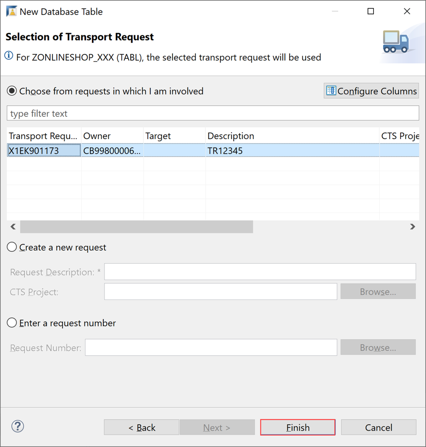
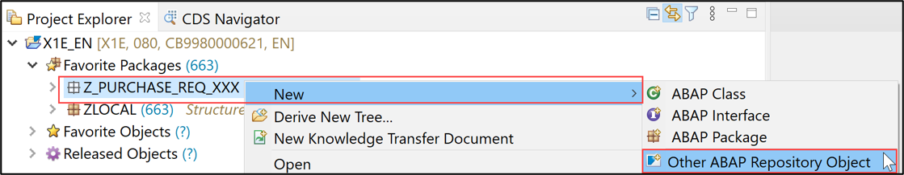
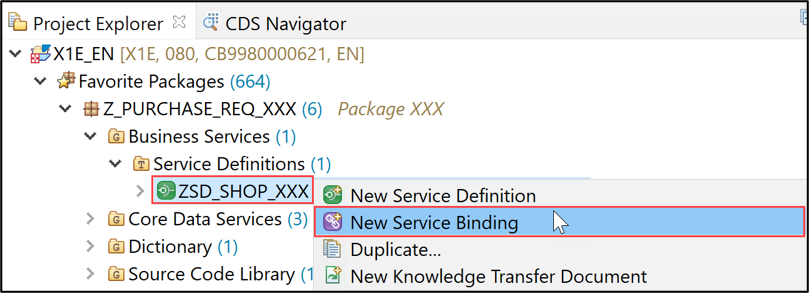

[Home - RAP610](../../#exercises)

# Exercise 1: Create Your Own Transactional UI Service

After the **[Getting Started](../ex0/README.md)**, you will create your own RAP business object (BO) in the present exercise. 

This RAP BO represents an online shop, where you can order laptops or airpods. 
When a laptop is ordered, a purchase requisition will be automatically created.


## Step 1.1: Create ABAP package
[^Top of page](#)

 <details>
  <summary>Click to expand!</summary>
  
1.	Right-click on the package **`ZLOCAL** and select **New > ABAP Package** from the context menu. 
   
2.	Maintain the information provided below and click **Next >**.  
    - Name: **`Z_PURCHASE_REQ_XXX`**
    - Description: `Package XXX`
    - Check ** `Add to favorite packages` ** 
 
 
 
3.	Create a new request and click **Finish**.

    - Description: _**`Developer Extensibility with RAP Facades (<your_group_ID>)`**_
   
    
  
</details>

## Step 1.2: Create Database Table
[^Top of page](#)

<details>
  <summary>Click to expand!</summary>
  
1.	Right-click your package **`Z_PURCHASE_REQ_XXX`** and select **New > Other ABAP Repository Object** from the context menu. 
    
   > **Do not forget to replace the suffix **`XXX`** with your group ID (e.g. your initials).**_
 
 
        
   
2.	Search for _**database table**_, select the entry, and click **Next >**. 
 
    

3.	Maintain the information provided below and click **Next >**.

    -	Name: **`ZONLINESHOP_XXX`**
    -	Description: _**`Shop to purchase electronics`**_ 
    
    

4.	Click **Finish**.
 
   !
 
5.	Replace the default source code with following code snippet:

    ```ABAP
     @EndUserText.label : 'Shop to purchase electronics'
     @AbapCatalog.enhancement.category : #NOT_EXTENSIBLE
     @AbapCatalog.tableCategory : #TRANSPARENT
     @AbapCatalog.deliveryClass : #A
     @AbapCatalog.dataMaintenance : #RESTRICTED
     define table zonlineshop_xxx {
      key client     : abap.clnt not null;
      key order_uuid : sysuuid_x16 not null;
      order_id       : abap.char(10) not null;
      ordereditem    : abap.char(10) not null;
      deliverydate   : abap.dats;
      creationdate   : abap.dats;
    }
    ```

6.	Save and activate the object.

</details>

## Step 1.3: Create CDS data model
[^Top of page](#)

 <details>
  <summary>Click to expand!</summary>
   
1.	Right-click your package **`Z_PURCHASE_REQ_XXX`** and select **New > Other ABAP Repository Object** from the context menu.
   
    
 
2.	Search for _**Data Definition**_, select the entry, and click **Next >**.
 
    
 
3.	Maintain the information provided below and click **Next >**.

   - Name: **`ZI_ONLINE_SHOP_XXX`**
   - Description: **`Data model for online shop`** .   
  
    
4. Select your transport request and click **Finish**.

    
 
5.	Replace the default source code with following code snippet:

    ```ABAP
     @EndUserText.label: 'Data model for online shop'
     @AccessControl.authorizationCheck: #CHECK
     define root view entity ZI_ONLINE_SHOP_XXX as select from ZONLINESHOP_XXX {
       key order_uuid as Order_Uuid,
       order_id as Order_Id,
       ordereditem as Ordereditem,
       deliverydate as Deliverydate,
       creationdate as Creationdate  
     }
     ```
     
6.	Save and activate the object.

</details>

## Step 1.4: Create Projection View
[^Top of page](#)

<details>
  <summary>Click to expand!</summary>
   
1.	Right-click **Data Definitions** and select **New Data Definition** from the context menu.
  
    
 
2.	Maintain the information provided below and click **Next >**.

    -	Name: **´ZC_ONLINE_SHOP_XXX`**
    -	Description: **_Projection view for online shop_**
    -	Referenced Object: **`ZI_ONLINE_SHOP_XXX`**
    
   
 
3. Select your transport request and click **Finish**.
   
   

4.	Replace the default source code with following code snippet:

      ```ABAP
       @EndUserText.label: 'shop projection'
       @AccessControl.authorizationCheck: #CHECK
       @Search.searchable: true
       @UI: { headerInfo: { typeName: 'Online Shop',
                           typeNamePlural: 'Online Shop',
                           title: { type: #STANDARD, label: 'Online Shop', value: 'order_id' } },
             presentationVariant: [{ sortOrder: [{ by: 'Creationdate',direction: #DESC }] }] }
       define root view entity ZC_ONLINE_SHOP_XXX provider contract transactional_query
        as projection on ZI_ONLINE_SHOP_XXX
       {

           @UI.facet: [          { id:                    'Orders',
                                         purpose:         #STANDARD,
                                        type:            #IDENTIFICATION_REFERENCE,
                                        label:           'Order',
                                         position:        10 }      ]
        key Order_Uuid,
            @UI: { lineItem:       [ { position: 10,label: 'order id', importance: #HIGH } ],
                     identification: [ { position: 10, label: 'order id' } ] }
            @Search.defaultSearchElement: true
            Order_Id,
            @UI: { lineItem:       [ { position: 20,label: 'Ordered item', importance: #HIGH } ],
                    identification: [ { position: 20, label: 'Ordered item' } ] }
            @Search.defaultSearchElement: true
            Ordereditem,
            Deliverydate       as Deliverydate,
            @UI: { lineItem:       [ { position: 50,label: 'Creation date', importance: #HIGH },
                                     { type: #FOR_ACTION, dataAction: 'create_pr', label: 'Update IR' } ],
                  identification: [ { position: 50, label: 'Creation date' } ] }
           Creationdate       as Creationdate
       }
      ```

5.	Save and activate the object.

</details>

## Step 1.5: Create Behavior Definition for CDS data model
[^Top of page](#)

<details>
  <summary>Click to expand!</summary>
      
1.	Right-click your data definition **`ZI_ONLINE_SHOP_XXX`** and select **New Behavior Definition** from the context menu.
 
   
 
2.	Maintain a description and click **Next >**.

     - Description: _**`Behavior for ZI_ONLINE_SHOP_XXX`**_
     
     

3.	Select your transport request and click **Finish**.
 
    
 
4.	Replace the default source code with following code snippet:

      ```ABAP
       managed implementation in class zbp_i_online_shop_xxx unique;
       define behavior for ZI_ONLINE_SHOP_XXX alias Online_Shop
       with additional save

       persistent table ZONLINESHOP_XXX
       lock master
       authorization master ( instance )

       {
        field ( numbering : managed, readonly ) order_Uuid;
        field ( mandatory ) Ordereditem;
        field ( readonly ) Creationdate, order_id, deliverydate;
        determination calculate_order_id on modify { create; }
       internal action create_pr;
        create;
        update;
        delete;
       }
       ```
 
5.	Save and activate the object.

</details>

## Step 1.6: Create Behavior Definition for Projection View
[^Top of page](#)

<details>
  <summary>Click to expand!</summary>
   
1.	Right-click your projection view **`ZC_ONLINE_SHOP_XXX`** and select **New Behavior Definition** from the context menu.
 
    
 
2.	Click **Next >**.

   
 
3.	Select your transport request and click **Finish**.
  
     
 
4.	Replace the default source code with following with code snippet:

    ```ABAP
     projection;
     //strict; //Comment this line in to enable strict mode. The strict mode is prerequisite to be future proof regarding syntax and to be able to release your BO.
     define behavior for ZC_ONLINE_SHOP_XXX //alias <alias_name>
     {
      use create;
      use update;
      use delete;
     }
     ```
 
5.	Save and activate the object.

</details>

## Step 1.7: Create Your Service Definition

 [^Top of page](#)

<details>
  <summary>Click to expand!</summary>
   
1. Right click on projection view **`ZC_ONLINE_SHOP_XXX`** and select create **New Service Definition** from the context menu.

    

2. Maintain the information provided below and click **Next >**.
    - Name: **`ZSD_SHOP_XXX`**
    - Description: _**Service definition for online shop_**

    

3. Select your transport request and press **Finish**. 

    

4. Save and activate the object.

</details>

## Step 1.8: Create Your Service Binding
[^Top of page](#)
 
<details>
  <summary>Click to expand!</summary>
   
1. Right-click on your service definition **`ZC_SHOP_XXX`** and select **New Service Binding** from the context menu.

    

2. Maintain the information provided below and click **Next**. 
    - Name: **`ZSB_SHOP_XXX`**
    - Description: _**`OData service V2 UI`**_
    - Binding Type: **`OData version V2 UI`**

    

3. Select your transport request and press **Finish**.

4. Activate and publish your service binding.

    

5. Click on **Fiori elements App Preview** to preview your application in the browser.

   

</details>

## Summary
[^Top of page](#)

You are through with this exercise and can continue with the next exercise – **[Exercise 2: Implement the Business Logic for Your Business Object](../ex2/README.md)**
