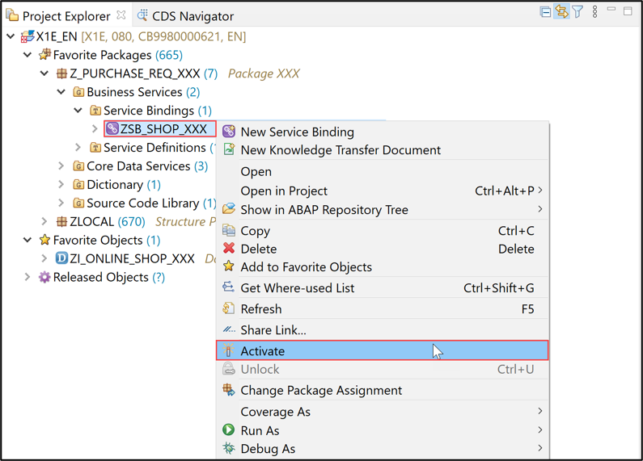

# Exercise 3: Create a Developer Extension using a PaaS API

In the previous exercise, you've implemented the enhanced business logic for your RAP BO **`ZI_C_ONLINE_SHOP_XXX`** (see **[Exercise 2](../ex2)**).

The created RAP BO **`ZRAP_C_SHOP_XXX`** can be used to order an item. For example, a laptop can be ordered with this application and the order data can be persisted.

In the present exercise, you will use the released RAP facade **`I_PurchaserequisitionTP`** to create a developer extension and check the result.

For this, perform the step below.

## Step 3.1: Implement the Internal Action

This internal action will trigger the PaaS API **`I_PurchaserequisitionTP`**.

<details>
  <summary>Click to expand!</summary>

1. In the behavior projection  **`ZI_C_ONLINE_SHOP_XXX`**, right-click on the internal action **`create_pr`**. 
    
    This will show a popup to create a implementation for the **`create_pr`** in the behavior implementation class.
    
    Confirm the dialog.

2. Copy and paste the following code snippet in the implementation for method **`create_pr`**.

    Replace in line  **`zbp_i_online_shop_xxx=>cv_pr_mapped = ls_pr_mapped`**, your own implementation class
    ```ABAP
      METHOD create_pr.

        IF keys IS NOT INITIAL.
         MODIFY ENTITIES OF i_purchaserequisitiontp
     ENTITY purchaserequisition
        CREATE FIELDS ( purchaserequisitiontype )
        WITH VALUE #(  ( %cid                    = 'My%CID_1'
                         purchaserequisitiontype = 'NB' ) )

       CREATE BY \_purchaserequisitionitem
       FIELDS ( plant
                purchaserequisitionitemtext
                accountassignmentcategory
                requestedquantity
                baseunit
                purchaserequisitionprice
                purreqnitemcurrency
                materialgroup
                purchasinggroup
                purchasingorganization
                    )
       WITH VALUE #(
                     (    %cid_ref = 'My%CID_1'
                          %target = VALUE #(
                                        (     %cid                            = 'My%ItemCID_1'
                                              plant                           = '1010'
                                              purchaserequisitionitemtext     = 'created from PAAS API XXX'
                                                accountassignmentcategory     = 'U'
                                              requestedquantity               = '8.00'
                                              baseunit                        = 'EA'
                                              purchaserequisitionprice        = '10.00'
                                              purreqnitemcurrency             = 'EUR'
                                              materialgroup                   = 'A001'
                                              purchasinggroup                 = '001'
                                              purchasingorganization          = '1010'

                                              )
                                           )
                      )
                    )
     ENTITY purchaserequisitionitem

     CREATE BY \_purchasereqnacctassgmt
        FIELDS ( CostCenter
                 GLAccount
                 Quantity
                 BaseUnit )
        WITH VALUE #( (   %cid_ref = 'My%ItemCID_1'
                          %target  = VALUE #( ( %cid         = 'My%AccntCID_1'
                                                CostCenter   = 'JMW-COST'
                                                GLAccount    = '0000400000' ) ) ) )
     CREATE BY \_purchasereqnitemtext
       FIELDS ( plainlongtext )
       WITH VALUE #(  (   %cid_ref = 'My%ItemCID_1'
                         %target  = VALUE #( ( %cid          = 'My%TextCID_1'
                                              textobjecttype = 'B01'
                                             language        = 'E'
                                              plainlongtext  = 'item text created from PAAS API XXX'
                                            ) ( %cid         = 'My%TextCID_2'
                                              textobjecttype = 'B02'
                                              language       = 'E'
                                              plainlongtext  = 'item2 text created from PAAS API XXX'
                                            ) )
                  )   )
              REPORTED DATA(ls_pr_reported)
              MAPPED DATA(ls_pr_mapped)
              FAILED DATA(ls_pr_failed).
          zbp_i_online_shop_xxx=>cv_pr_mapped = ls_pr_mapped.
        ENDIF.
      ENDMETHOD.
    ```

3. Save and activate the object.

</details>

## Step 3.2: Activate and Publish Your Service Binding
[^Top of page](#)

Activate and publish your service binding.

<details>
  <summary>Click to expand!</summary>
 
1.	Right-click your service binding **`ZSB_SHOP_XXX`** and select **Activate**.
 
    
 
2.	Click **Publish** to publish your service binding.

    

</details>
 
## Step 3.3: Run the Fiori elements App Preview
[^Top of page](#)

Run the Fiori elements app preview.

<details>
  <summary>Click to expand!</summary>
  
1.	Select the entity **`online_shop`** in your service binding and click **Preview** to start the Fiori elements app preview.
    
    

2.	Click **Create** to create a new entry.
    
    
  
3.	Enter an **id** and **date**, and click **Create**.
    
    
    
4.	Check the result.
    
    

</details>

## Step 3.4: Check the Result

You can now check the purchase requisition.

<details>
  <summary>Click to expand!</summary>
 
1.	In the **Project Explorer**, select your system, and right-click on **Properties**.

    

2.	Select **ABAP Development**, copy the system URL without _-api_, paste it in a browser, and log in with your ABAP user credentials.
    
    
  
3.	Select the **Manage Purchase Requisitions** tile.
    
    
    
4.	Click **Go**.

    
    
5.	Select your purchase requisition.

    
    
6.	Check your purchase requisition item and select it.   
    Your group ID should appear here instead of **`XXX`**.

    
    
7.	Select **Notes** and check your item text.   
    Your ID should appear here instead of **`XXX`**.  

    
    
8.	Check your item note.     
    Your ID should appear here instead of **`XXX`**.
 
    

</details>

 ## Summary
[^Top of page](#)

You are through with this exercise.

Congratulations, you are through with the full workshop! :-)

You can go to the [further information](../../README.md/further-information) to find more information. 


