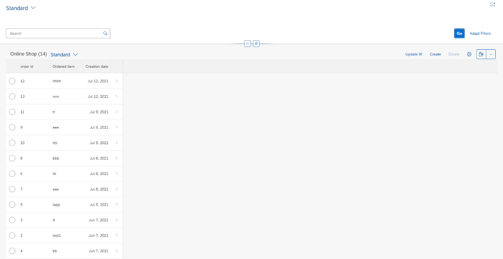
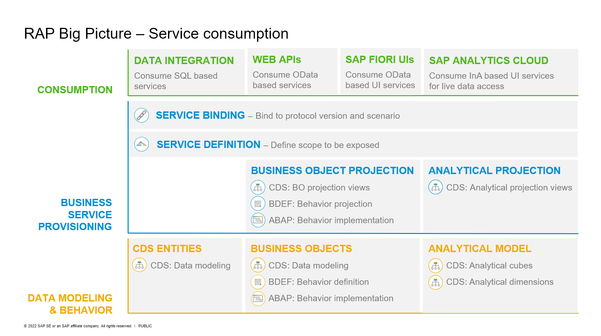

# RAP610: Developer extensibility with SAP S/4HANA Cloud ABAP Environment - RAP Facades

<!-- 
## Description
-->

This repository contains the material for the hands-on session **RAP610: Developer extensibility with SAP S/4HANA Cloud ABAP Environment - RAP Facades**.

- [Requirements for attending this workshop](#requirements-for-attending-this-workshop)
- [Overview](#overview)
- [Exercises](#exercises)
- [How to obtain support](#how-to-obtain-support) 
- [Further Information](#further-information)

## Requirements for attending this workshop 
[^Top of page](#)

In order to participate in this hands-on session, you MUST have installed the latest version of Eclipse and the latest version of the ABAP Development Tools (ADT) in Eclipse.
Please check the following two short documents how to do this if you have not already done it:  
- [Install the ABAP Development Tools (ADT)](https://github.com/SAP-samples/abap-platform-rap-workshops/blob/main/requirements_rap_workshops.md#3-install-the-abap-development-tools-adt)  
- [Adapt the Web Browser settings in your ADT installation](https://github.com/SAP-samples/abap-platform-rap-workshops/blob/main/requirements_rap_workshops.md#4-adapt-the-web-browser-settings-in-your-adt-installation)  
 
You also need a user on an SAP S/4HANA Cloud ABAP Environment system.  
> **Note for participants of SAP events:** You will recieve logon information from the SAP team during the event. 

## Overview
[^Top of page](#)

> SAP S/4HANA Cloud ABAP Environment (aka _Embedded Steampunk_)  
> - allows upgrade-stable development on top of an ABAP Platform Cloud based solution like SAP S/4HANA Cloud
> - adds the ABAP developer role to the existing key-user role to build extensions directly on SAP S/4HANA Cloud
> - reuses the top layer of SAP BTP ABAP Environment (aka _Steampunk_): The Steampunk ABAP development model

This hands-on workshop will guide you to build developer extensions in an SAP S/4HANA Cloud ABAP Environment system (aka _Embedded Steampunk_) using RAP facades. 
A RAP facade is a business object interface built with the ABAP RESTful Application Programming Model (RAP).

You will create your own transactional Fiori elements app with the ABAP RESTful Application Programming Model (RAP) and use released RAP facades to enhance the existing functionality. 

 For that, you will build a custom business object with RAP and enhance the business context with **released RAP facades** for _Purchase Requisitions_. The released RAP facades from Procurements will be accessed via local API in the existing S/4HANA Cloud system. 

### Business Scenario 

 
Click to expand!

 
 **Create a custom BO for a specific business context and integrate released RAP facades**

 - An existing customer/partner wants to create a new business application for a online shopping platform. Users of this shopping App can order a item like a laptop. This can be realized with Restful ABAP Programming Model(RAP). 

 - You’ll build the application step-by-step, starting with exposing an OData service based on a prepared Core Data Services (CDS) model enriched with UI annotations, and display it in a SAP Fiori elements based List Report. Then you’ll enable the application for transactional processing by enhancing the business object (BO) with CRUD operations – i.e. create, update, read and delete – and business-specific functionality.

 - Now, the customer/partner wishes to enhance the existing online shop application. When an order for a laptop is placed, then a purchase requisition for this order should be initiated. Using the developer extensibility and released RAP facades in SAP S/4HANA Cloud ABAP Environment, custom code can be added to existing business logic of the online shop BO to fulfill this requirement.

 Your application will finally look like this:

 

 In an additional exercise, you can create a new sales order in an ABAP class using released RAP facades and Entity Manipulation Langauge (EML).

### Architecture Overview

 
Click to expand!

 The figure below illustrates the high-level architecture components of the ABAP RESTful Application Programming Model (RAP). It shows the main technologies and artefacts needed to build an SAP Fiori app or a Web API with RAP from a design time perspective.  
 
 
 
 You can find a more information on the various RAP concepts on the SAP Help Portal.

 

 

## Exercises
[^Top of page](#)

| Exercises |  
| ------------- | 
| [Get started](ex0/README.md) | 
| [Exercise 1: Create Your Own Transactional UI Service](ex1/README.md) | 
| [Exercise 2: Implement the Business Logic of Your Business Object](ex2/README.md) | 
| [Exercise 3: Create a Developer Extension using a PaaS API](ex3/README.md) | 

## How to obtain support
[^Top of page](#)

Support for the content in this repository is available during the actual time of the online session for which this content has been designed. Otherwise, you may request support via the [Issues](../../../../issues) tab.

## Further Information
[^Top of page](#)

You can find further information on the different topics here: 
- [SAP S/4HANA Cloud ABAP Environment](https://www.sap.com/about/events/teched-news-guide/composable-enterprise-solutions.html)
- [New ABAP Platform Extensibility Options for SAP S/4HANA](https://blogs.sap.com/2021/11/19/new-abap-platform-extensibility-options-in-2021/)
- [Getting Started with the ABAP RESTful Application Programming Model (RAP)](https://blogs.sap.com/2019/10/25/getting-started-with-the-abap-restful-programming-model/)
- [ABAP Extensibility Topic Page @SAP Community](https://community.sap.com/topics/abap-extensibility)

## License
Copyright (c) 2022 SAP SE or an SAP affiliate company. All rights reserved. This file is licensed under the Apache Software License, version 2.0 except as noted otherwise in the [LICENSE](LICENSES/Apache-2.0.txt) file.

